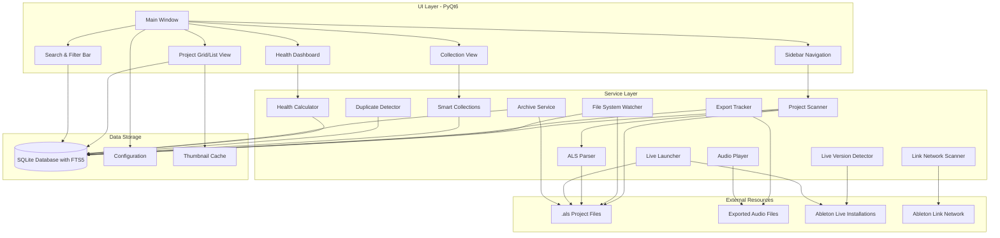

<div align="center">
  
</div>

# Ableton Hub

## What is Ableton Hub?

Ableton Hub is a desktop application that helps you organize, manage, and discover your Ableton Live projects across multiple locations. Whether your projects are on your computer, external drives, network shares, or cloud storage, Ableton Hub scans and indexes them all in one place. Creating collections of your projects and mapping exports to projects with deep learning of your project stats.

**Key Benefits:**
- **Find projects quickly** - Search across all your projects by name, tempo, plugins, or tags
- **Organize with collections** - Create albums, EPs, or custom collections to group related projects
- **Track your exports** - Automatically find and link exported audio files to their source projects
- **Launch with Live** - Open any project directly in Ableton Live with your preferred version
- **Discover patterns** - See which plugins and devices you use most across your projects

Built with Python (programming language) and PyQt6 (GUI framework), Ableton Hub provides powerful tools for music producers to maintain their project libraries and seamlessly integrate with their Ableton Live workflow.

<div align="center">
  
</div>

## 🎵 Features

### Core Functionality

#### Project Discovery & Management
- **Multi-Location Scanning**: Scan and index Ableton `.als` project files across multiple locations (local drives, network shares, cloud storage)
- **Automatic File Watching**: Real-time detection of new, modified, or deleted projects using file system watchers
- **Project Metadata Extraction**: Automatically extracts rich metadata from `.als` files including:
  - Plugins and devices used
  - Tempo and time signature
  - Track counts (audio, MIDI, return tracks)
  - Arrangement length
  - Ableton Live version
  - Sample references
  - Automation status
- **File Hash Tracking**: SHA256 hashing for duplicate detection and integrity verification
- **Project Health Dashboard**: Monitor project health metrics, identify issues, and track project status
- **Visual Export Indicators**: Projects with exports display colorized icons

#### Project Collections & Organization
- **Static Collections**: Create custom collections for albums, EPs, sessions, compilations, and more
- **Smart Collections**: Rule-based dynamic collections that auto-update based on criteria:
  - Filter by tags, locations, date ranges
  - Filter by plugins, devices, or project metadata
  - Filter by rating, favorites, or export status
  - Filter by tempo range (min/max BPM)
- **Track Management**: Organize projects within collections as tracks with:
  - Custom track names
  - Per-track artwork
  - Drag-and-drop reordering
- **Collection Types**: Support for albums, EPs, sessions, compilations, and custom types

#### Search & Discovery
- **Full-Text Search**: Powerful search (using FTS5 - Full-Text Search engine) across:
  - Project names
  - Export song names
  - Notes and tags
  - Plugins and devices
- **Advanced Filtering**:
  - Date filters (Today, This Week, This Month, Last 7/30 Days, Custom Range)
  - Location-based filtering
  - Tag-based filtering
  - Plugin/device search
  - Tempo range filtering (preset ranges: 60-90, 90-120, 120-150, 150+ BPM or custom)
- **Search Modes**: Filter by name, export name, tags, or notes
- **Real-time Results**: Debounced search with instant results
- **Always-Visible Tempo Filter**: Quick-access tempo range buttons in the search bar

#### Location Management
- **Multiple Location Types**:
  - Local folders
  - Network shares
  - Dropbox/Cloud storage
  - USB drives
  - Custom locations
- **Location Features**:
  - Favorite locations
  - Color coding
  - Active/inactive status
  - Project count tracking
  - Last scan timestamp
- **Bulk Operations**: Scan all active locations at once
- **Location Statistics**: View project counts, total size, and scan history

#### Tagging System
- **Flexible Tagging**: Create and assign tags with categories
- **Color-Coded Tags**: Visual organization with custom colors
- **Tag Management**: Full CRUD operations for tags
- **Tag Filtering**: Filter projects by one or more tags

#### Export Tracking
- **Automatic Export Detection**: Scans for exported audio files during project scanning:
  - Searches project folders, location roots, and common export directories (Exports, Renders, Bounces, Mixdowns)
  - Smart fuzzy matching handles renamed exports (strips "project" suffix, version numbers, date stamps)
  - Three-tier matching: exact match → normalized match → fuzzy match (65% threshold)
- **Export Metadata**: Track export formats, bit depths, sample rates, file sizes
- **Export-to-Project Mapping**: Link exports back to source projects with confidence scoring
- **Export Status Indicators**: Green border and 🔊 icon for projects with playable exports
- **Export Song Name**: Set custom export names to improve matching accuracy

#### Duplicate Detection
- **Multiple Detection Methods**:
  - File hash comparison (SHA256)
  - Name similarity matching
  - Location-based detection
- **Duplicate Reports**: View and manage duplicate projects
- **Smart Merging**: Options to merge or remove duplicates

#### Project Status & Cleanup
- **Missing Project Detection**: Automatically marks projects as MISSING when files are deleted or moved
- **Backup Project Exclusion**: Backup .als files in Backup folders are automatically excluded from project grid
- **Backup Project Access**: View and launch backup project versions from Project Properties dialog
- **Missing Projects View**: Toggle to view MISSING projects in the View menu
- **Database Cleanup**: Tools menu options to clean up MISSING projects or reset the entire database

#### Ableton Live Integration
- **Live Version Detection**: Automatically detect installed Ableton Live versions
- **Live Launcher**: Launch projects with a specific Live version
- **Version Management**: View all installed Live versions in the sidebar
- **Quick Launch**: Double-click projects to open with Live
- **Preferences Access**: Right-click Live installations to:
  - Open the Preferences folder for that version
  - Edit or create `Options.txt` for advanced configuration

#### Backup & Archive
- **Backup Location Management**: Configure a dedicated backup folder from the sidebar
- **Project Backups View**: See all backup copies of a project in the Project Properties dialog
- **Backup Project Launch**: Double-click any backup in the list to launch it with Ableton Live
- **Automatic Backup Detection**: Finds backup .als files in Backup folders and timestamped filenames
- **Archive Service**: Create compressed (ZIP) backups of projects with all assets
- **One-Click Archive**: Archive projects directly to your configured backup location

#### Ableton Link Network
- **Link Device Discovery**: Discover and monitor devices on your Ableton Link network
- **Real-time Monitoring**: Live updates of Link network status
- **Device Information**: View device names, IP addresses, and connection status

#### MCP Servers Integration
- **Quick Access Links**: Sidebar section with links to popular Ableton MCP server projects:
  - ableton-mcp (GitHub)
  - ableton-copilot-mcp (GitHub)
  - Live control via MCP documentation and resources

#### Audio Preview & Playback
- **Waveform Thumbnails**: Generate visual waveform previews from exported audio files
- **Automatic Generation**: Thumbnails created automatically during export tracking
- **Default Artwork**: Uses Ableton logo as default thumbnail when preview unavailable
- **Click-to-Play on Project Cards**: Single-click any project card with exports to instantly play audio
  - Click again to cycle through multiple exports
  - Click on last export to stop playback
  - Visual feedback shows current export name and position (e.g., "🔊 MySong (2/3)")
- **Status Bar Playback Display**: Shows currently playing filename in the status bar with green highlight
- **In-App Audio Playback**: Play exported audio files directly from the project details:
  - Play/Pause and Stop controls
  - Seek slider with time display
  - Volume control
  - Support for WAV, AIFF, MP3, FLAC, OGG, and M4A formats
  - Cross-platform audio playback using Qt Multimedia

#### User Interface
- **Multiple Themes**: Choose from Orange (default), Cool Blue, Green, or Rainbow themes inspired by Ableton Live's aesthetic
- **Grid & List Views**: Toggle between grid and list views for projects
- **Sortable List View**: Click column headers to sort by:
  - Name (A-Z / Z-A)
  - Location (ascending / descending)
  - Tempo (low to high / high to low)
  - Modified date (newest / oldest)
  - Tags, Export status, and more
- **Learning Resources**: Built-in links to:
  - Official Ableton documentation
  - Certified trainers directory
  - Regional user groups (Austin, Chicago, San Francisco)
  - Ableton Discord community

## 📋 Requirements

- **Python** (programming language): Version 3.11 or higher
- **Operating System**: 
  - macOS 10.15+ (Catalina or later)
  - Windows 10/11
  - Linux (with Qt6 support)

## 🚀 Installation

Choose the installation method that works best for you. If you're new to Python or command-line tools, see the detailed platform-specific guides below.

### Method 1: Install from GitHub (Recommended)

This is the easiest method - pip (Python package installer) will automatically download and install everything you need.

**macOS:**
```bash
pip install git+https://github.com/yourusername/ableton-hub.git
ableton-hub
```

**Windows:**
```bash
pip install git+https://github.com/yourusername/ableton-hub.git
ableton-hub
```

This method will:
- ✅ Automatically install all dependencies (PyQt6, SQLAlchemy, ML libraries, etc.)
- ✅ Create the `ableton-hub` command in your PATH (system path)
- ✅ Work on Windows, macOS, and Linux
- ✅ Allow easy updates: `pip install --upgrade git+https://github.com/yourusername/ableton-hub.git`

> **Note**: This method requires Python 3.11+ to be installed. Most macOS users already have Python installed. See platform-specific guides below if you need help checking or installing Python.

### Method 2: Download Source and Install

If you prefer to download the source code and install manually:

1. **Download the source code**:
   - Go to the GitHub repository and click "Code" → "Download ZIP"
   - Extract the ZIP file to a folder on your computer

2. **Open Terminal (macOS) or Command Prompt/PowerShell (Windows)**:
   - macOS: Press `Cmd + Space`, type "Terminal", and press Enter
   - Windows: Press `Win + R`, type "cmd" or "powershell", and press Enter

3. **Navigate to the extracted folder**:
   ```bash
   # macOS
   cd ~/Downloads/Ableton-Hub-main
   
   # Windows (adjust path as needed)
   cd C:\Users\YourName\Downloads\Ableton-Hub-main
   ```
   
   **Note**: When you download the ZIP from GitHub, it extracts to a folder named `Ableton-Hub-main`. Make sure you're inside this folder before running the installation commands.

4. **Set up a virtual environment** (recommended - keeps dependencies isolated):
   ```bash
   # macOS
   python3 -m venv .venv
   source .venv/bin/activate
   
   # Windows
   python -m venv .venv
   .venv\Scripts\activate.bat
   ```

5. **Install dependencies**:
   ```bash
   pip install -r requirements.txt
   ```

6. **Run the application**:
   ```bash
   python -m src.main
   ```

### Platform-Specific Installation Guides

For detailed step-by-step instructions with troubleshooting help:

- **[macOS Installation Guide](docs/INSTALLATION_MAC.md)** - Complete Mac setup instructions
- **[Windows Installation Guide](docs/INSTALLATION_WINDOWS.md)** - Complete Windows setup instructions

These guides include:
- How to check if Python is installed
- How to install Python if needed
- How to verify your installation worked
- Common issues and solutions

## 🎯 First Time Setup

New to Ableton Hub? Check out the **[First Time Setup Guide](docs/FIRST_TIME_SETUP.md)** for a detailed walkthrough of what to expect on your first launch and how to get started.

**Quick Overview:**
1. **Launch the application** using one of the installation methods above
2. **Add your first location**:
   - Click "Add Location" in the sidebar
   - Select a folder containing Ableton projects
   - Choose location type (Local, Network, Cloud, etc.)
3. **Scan for projects**:
   - Click the "Scan" button in the toolbar
   - Wait for the scan to complete (this may take a few minutes depending on how many projects you have)
   - Projects will appear in the main view
4. **Explore your projects**:
   - Double-click any project to open it in Ableton Live
   - Use the search bar to find projects by name, tempo, or plugins
   - Click project cards to see details and play exports

**Next Steps:**
- Create collections to organize related projects
- Add tags to categorize your projects
- Explore the search and filtering options
- Check out the Health Dashboard to see project statistics

## 📚 Additional Resources

- **[First Time Setup Guide](docs/FIRST_TIME_SETUP.md)** - Detailed walkthrough for new users
- **[macOS Installation Guide](docs/INSTALLATION_MAC.md)** - Step-by-step Mac installation
- **[Windows Installation Guide](docs/INSTALLATION_WINDOWS.md)** - Step-by-step Windows installation
- **[Quick Reference](docs/QUICK_REFERENCE.md)** - Common tasks and keyboard shortcuts
- **[FAQ](docs/FAQ.md)** - Frequently asked questions

## 🛠️ For Developers

This section contains technical information for developers who want to contribute to or modify Ableton Hub.

### Architecture

> If viewing on mobile, expand the "View Diagram (Mobile)" section below for an image version.



<details>
<summary><strong>View Diagram (Mobile)</strong></summary>

If the Mermaid diagram above doesn't render (e.g., on GitHub mobile app), view the architecture diagram below:

<div align="center">
  
</div>

</details>

### Architecture Overview

The application follows a layered architecture:

**UI Layer (PyQt6 - GUI framework)**
- Main Window orchestrates all UI components
- Sidebar Navigation provides access to locations, collections, and Live installations
- Project Grid/List View displays projects with multiple view modes
- Search & Filter Bar enables full-text search and advanced filtering
- Collection View manages static and smart collections
- Health Dashboard visualizes project health metrics

**Service Layer**
- Project Scanner discovers and indexes `.als` files
- File System Watcher monitors for real-time changes
- ALS Parser extracts metadata from project files
- Live Version Detector finds installed Ableton Live versions
- Live Launcher opens projects with specific Live versions
- Link Network Scanner discovers Ableton Link devices
- Export Tracker identifies and links exported audio files
- Smart Collections creates rule-based dynamic collections
- Duplicate Detector finds duplicate projects using hash comparison
- Health Calculator computes project health metrics
- Audio Player provides in-app playback of exported audio
- Archive Service handles project backup and archiving

**Data Storage**
- SQLite Database (file-based database) with FTS5 (Full-Text Search engine) stores all project metadata and enables full-text search
- Configuration stores user preferences and settings
- Thumbnail Cache stores generated waveform previews

**External Resources**
- `.als` Project Files are read-only parsed for metadata
- Exported Audio Files are linked to projects and can be played
- Ableton Live Installations are detected and used for launching projects
- Ableton Link Network is monitored for device discovery

**Data Flow**
- UI components interact with services, which read/write to the database
- Scanner and Watcher monitor project files and update the database
- Services like Export Tracker and Archive Service interact with both files and database
- All user preferences and window state are persisted in configuration

### Setup Development Environment

1. **Clone the repository** (using git - version control system):
   ```bash
   git clone https://github.com/yourusername/ableton-hub.git
   cd ableton-hub/ableton_hub
   ```
   
   **Note**: If downloading as ZIP instead of using git clone, extract the ZIP and navigate to the `Ableton-Hub-main` folder (the folder name when downloading from GitHub).

2. **Create a virtual environment** (isolated Python environment):
   ```bash
   # macOS
   python3 -m venv venv
   source venv/bin/activate
   
   # Windows
   python -m venv venv
   venv\Scripts\activate
   ```

3. **Install with dev dependencies**:
   ```bash
   pip install -e ".[dev]"
   ```

4. **Run tests**:
   ```bash
   pytest
   ```

5. **Format code**:
   ```bash
   black src tests
   ruff check src tests --fix
   ```

6. **Type checking**:
   ```bash
   mypy src
   ```

### Application Data Locations

The application stores data in platform-specific locations:

**Windows:**
- Config & Database: `%APPDATA%\AbletonHub\`
- Thumbnail Cache: `%LOCALAPPDATA%\AbletonHub\cache\`

**macOS:**
- Config & Database: `~/Library/Application Support/AbletonHub/`
- Thumbnail Cache: `~/Library/Caches/AbletonHub/`

**Linux:**
- Config & Database: `~/.local/share/AbletonHub/`
- Thumbnail Cache: `~/.cache/AbletonHub/`

### Database

The application uses SQLite with FTS5 (Full-Text Search) for project metadata. The database file is located in the application data directory (see above) and is automatically created and migrated on first run.

### Configuration

User preferences, window state, and settings are stored in a JSON configuration file in the application data directory. The configuration is automatically loaded and saved.

### Version Management

The application version uses a **single source of truth** pattern:

**To release a new version:**
1. Update `pyproject.toml` → `[project]` → `version`
2. Update `src/__init__.py` → `WHATS_NEW` dictionary with new features

**How it works:**
- `pyproject.toml` defines the package version
- `src/__init__.py` reads from `importlib.metadata` when installed, or uses fallback
- `src/app.py` and `src/ui/main_window.py` import `__version__` from the package
- The About dialog pulls "What's New" content from `src/__init__.py` → `get_whats_new_html()`

> **Note**: The "What's New" section is maintained in `src/__init__.py` and displayed in the in-app About dialog. Feature lists in the README are updated as needed for documentation.

## 🔧 Troubleshooting

Having issues? Here are solutions to common problems:

### I can't install Python or pip isn't working

**macOS:**
- Most Macs come with Python installed. Check by opening Terminal and typing: `python3 --version`
- If Python isn't installed, download it from [python.org](https://www.python.org/downloads/) or use Homebrew: `brew install python3`
- See the [macOS Installation Guide](docs/INSTALLATION_MAC.md) for detailed help

**Windows:**
- Download Python from [python.org](https://www.python.org/downloads/)
- During installation, make sure to check "Add Python to PATH"
- See the [Windows Installation Guide](docs/INSTALLATION_WINDOWS.md) for detailed help

### The app won't start

- Ensure Python 3.11+ is installed (check with `python --version` or `python3 --version`)
- If you used Method 2 (source installation), make sure you activated the virtual environment (`.venv`)
- Try reinstalling: `pip install --upgrade git+https://github.com/yourusername/ableton-hub.git`
- On Linux, you may need additional system libraries for PyQt6 (GUI framework)

### I don't see my projects

- Check that locations are added and active in the sidebar
- Verify the scan completed successfully (check the status bar at the bottom)
- Make sure `.als` files are in the folders you're scanning
- Try clicking "Scan All Locations" in the toolbar
- Check the "View" menu → "Show Missing Projects" to see if projects were marked as missing

### Audio playback isn't working

- Make sure you have exported audio files (WAV, MP3, etc.) in your project folders
- On Linux, you may need to install audio codecs: `sudo apt-get install gstreamer1.0-plugins-base gstreamer1.0-plugins-good`
- Try clearing the thumbnail cache: Tools → Clear Thumbnail Cache

### I'm confused by the interface

- Check out the [First Time Setup Guide](docs/FIRST_TIME_SETUP.md) for a walkthrough
- See the [Quick Reference](docs/QUICK_REFERENCE.md) for common tasks
- Browse the [FAQ](docs/FAQ.md) for answers to common questions

### Something went wrong

- Check the status bar at the bottom of the window for error messages
- Try resetting the database: Tools → Reset Database (⚠️ This will delete all your indexed projects)
- If the problem persists, open an issue on GitHub with details about what happened

### Project Structure

```
ableton_hub/
├── src/
│   ├── main.py                     # Application entry point
│   ├── app.py                      # Main QApplication setup
│   ├── config.py                   # Configuration manager
│   ├── database/                   # SQLAlchemy models and migrations
│   │   ├── models.py               # ORM models
│   │   ├── db.py                   # Database connection and setup
│   │   └── migrations.py           # Schema migrations
│   ├── services/                   # Business logic
│   │   ├── scanner.py              # File system scanner
│   │   ├── watcher.py              # File system watcher
│   │   ├── als_parser.py           # .als file parser
│   │   ├── live_detector.py        # Live version detection
│   │   ├── live_launcher.py        # Live launcher
│   │   ├── link_scanner.py         # Ableton Link discovery
│   │   ├── export_tracker.py       # Export tracking
│   │   ├── smart_collections.py    # Smart collection rules
│   │   ├── duplicate_detector.py   # Duplicate detection
│   │   ├── health_calculator.py    # Health metrics
│   │   ├── audio_preview.py        # Audio preview generation
│   │   ├── audio_player.py         # In-app audio playback
│   │   └── archive_service.py      # Project backup/archive
│   ├── ui/                         # PyQt6 UI components
│   │   ├── main_window.py          # Main application window
│   │   ├── theme.py                # Dark Ableton theme
│   │   ├── widgets/                # Reusable UI widgets
│   │   └── dialogs/                # Modal dialogs
│   └── utils/                      # Utility functions
├── tests/                          # Test suite
├── resources/                      # Icons, images, styles
│   ├── images/                     # Application images
│   ├── icons/                      # Application icons
│   └── styles/                     # Stylesheets
├── docs/                           # Documentation
│   ├── FEATURE_RECOMMENDATIONS.md
│   └── PHASE_25_IMPLEMENTATION.md
├── requirements.txt                # Python dependencies
├── pyproject.toml                  # Project configuration
└── README.md                       # This file
```

### Default Project Locations

The application can automatically detect default Ableton project folders (only existing directories are suggested):

**macOS:**
- `~/Music/Ableton/`
- `~/Documents/Ableton/`
- `~/Library/Application Support/Ableton/`
- `~/Music/Ableton/User Library/`

**Windows:**
- `%USERPROFILE%\Documents\Ableton\`
- `%USERPROFILE%\Music\Ableton\`
- `%APPDATA%\Ableton\`
- `%USERPROFILE%\Documents\Ableton\User Library\`

**Linux:**
- `~/Music/Ableton/`
- `~/Documents/Ableton/`

> **Note**: Live installation detection (for launching projects) searches different locations than project folders. The application automatically detects installed Live versions from standard installation paths.

### Technical Details

#### .als File Parsing

The application parses Ableton Live Set (`.als`) files to extract metadata. The parser reads:
- **Project Information**: Name, Live version, creation/modification dates
- **Tempo & Time Signature**: Current song tempo and time signature
- **Track Information**: Audio tracks, MIDI tracks, return tracks, master track
- **Device & Plugin Data**: All devices and plugins used in the project
- **Arrangement Data**: Arrangement length (bars), automation status
- **Sample References**: Linked audio files and samples

The parser handles `.als` files from Live 9.x through Live 12.x. The `.als` format is XML-based (eXtensible Markup Language), and the parser uses standard XML parsing with error handling for malformed files.

#### Live Version Compatibility

- **Detected Versions**: Automatically detects Live 9.x, 10.x, 11.x, and 12.x installations
- **Launch Support**: Can launch projects with any detected Live version
- **Version-Specific Features**: Some metadata extraction may vary by Live version

#### Ableton Link Integration

The application includes Ableton Link network discovery using the `zeroconf` library (zero-configuration networking). It can:
- Discover devices on the Link network
- Monitor Link network status
- Display device information (name, IP address)

This does not interfere with Live's Link functionality and operates in read-only mode.

#### Data Privacy & Security

- **Local-Only Storage**: All data is stored locally; no cloud sync or external services
- **No Network Communication**: The application does not send any data to external servers
- **Read-Only Access**: The application only reads `.als` files and does not modify them
- **Export Detection**: Uses fuzzy matching (approximate string matching) to link exported audio files to projects (no modification of export files)

#### Technical Stack

- **UI Framework**: PyQt6 (Qt 6.6+) for cross-platform GUI (Graphical User Interface)
- **Database**: SQLite (file-based database) with FTS5 (Full-Text Search engine) for full-text search
- **Async Operations**: `qasync` (async/await support library) for async/await support with Qt event loop
- **File Watching**: `watchdog` (file system monitoring library) for real-time file system monitoring
- **Audio Playback**: Qt Multimedia (QMediaPlayer) for cross-platform audio preview

#### Project Structure & Architecture

The application follows a clean architecture pattern:
- **UI Layer**: PyQt6 widgets and dialogs (presentation layer)
- **Service Layer**: Business logic and domain services
- **Data Layer**: SQLAlchemy ORM (Object-Relational Mapping) with repository pattern
- **Utils**: Cross-platform utilities and helpers

This separation allows for easy testing and future enhancements without major refactoring.

## 🤝 Contributing

Contributions are welcome! Please follow these guidelines:

1. Fork the repository
2. Create a feature branch (`git checkout -b feature/amazing-feature`)
3. Make your changes
4. Add tests if applicable
5. Ensure all tests pass (`pytest`)
6. Format code (`black src tests && ruff check src tests --fix`)
7. Commit your changes (`git commit -m 'Add amazing feature'`)
8. Push to the branch (`git push origin feature/amazing-feature`)
9. Open a Pull Request

### Code Style

- Follow PEP 8 style guidelines
- Use type hints where appropriate
- Write docstrings for all public functions and classes
- Keep functions focused and single-purpose


## 🔮 Roadmap

### Recently Completed
- ✅ Click-to-play exports on project cards
- ✅ Automatic export detection during scanning
- ✅ Smart fuzzy matching for export-to-project linking
- ✅ Status bar playback display
- ✅ Tempo filtering and sorting
- ✅ Sortable list view with column headers
- ✅ In-app audio playback for exports
- ✅ Project backup and archive system
- ✅ Backup project detection and exclusion from grid
- ✅ Backup project access and launch from Project Properties
- ✅ Missing project detection and cleanup tools
- ✅ View Missing Projects toggle in View menu
- ✅ Live preferences and Options.txt access
- ✅ MCP servers integration links
- ✅ Smart collection tempo rules
- ✅ Visual project export indicators

### In Progress
- 🔄 Deep project analysis (plugin patterns, similarity detection)

### Planned
- **Pack Management & Browsing**:
  - Full pack browser with installed pack detection
  - Pack usage statistics and tracking
  - Pack-to-project associations
  - Pack version tracking and update detection
- **Ableton Lesson Integration**:
  - Browse built-in Ableton Live lessons
  - Lesson table of contents viewer
  - Integration with Ableton's native lesson format
- Project versioning and history tracking
- Project relationships and linking (stems, remixes, versions)
- Cloud sync integration
- Workflow analytics dashboard
- AI/ML project clustering and recommendations
- Real-time Ableton Live integration (OSC)
- Plugin usage dashboard
- Project similarity detection


## 📝 License

MIT License - see LICENSE file for details.

## 👤 Author

**Tom Carlile**  
Email: carlile.tom@gmail.com

## ⚠️ Disclaimer

This application is an independent, open-source project and is **not affiliated with, endorsed by, or connected to Ableton AG**. Ableton Live is a trademark of Ableton AG. This tool is designed to help music producers organize their Ableton Live projects and is provided as-is without warranty.

## 🙏 Acknowledgments

- Inspired by Ableton Live's workflow and design aesthetic
- Built with [PyQt6](https://www.riverbankcomputing.com/software/pyqt/)
- Uses [SQLAlchemy](https://www.sqlalchemy.org/) for database management
- [Ableton](https://www.ableton.com/) for creating amazing music production software

## 📞 Support

For issues, questions, or feature requests, please open an issue on GitHub.


