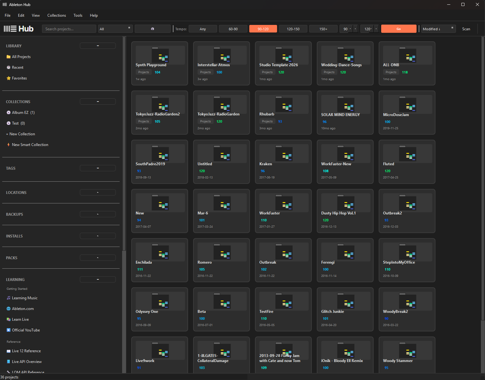
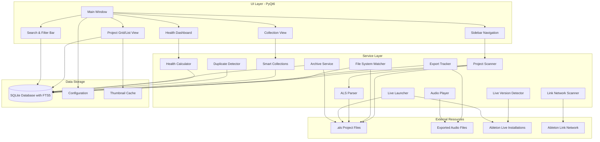
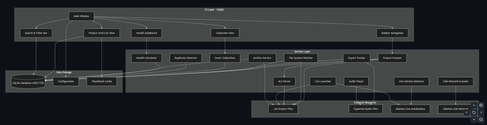

<div align="center">
  
</div>

# Ableton Hub

A comprehensive cross-platform desktop application for organizing, managing, and discovering Ableton Live projects across multiple locations. Built with Python and PyQt6, Ableton Hub provides powerful tools for music producers to maintain their project libraries, create collections, track exports, and seamlessly integrate with their Ableton Live workflow.

<div align="center">
  
</div>

## 🆕 What's New (v0.3.0)

- **Tempo Filtering & Sorting**: Filter projects by tempo range (60-90, 90-120, 120-150, 150+ BPM or custom range) with always-visible controls in the search bar
- **Enhanced List View**: Click column headers to sort by Name, Location, Tempo, Modified date, and more
- **Audio Playback**: Play exported audio files directly from the project details dialog with full transport controls (WAV, AIFF, MP3, FLAC, OGG, M4A)
- **Backup & Archive**: Configure a backup location and archive projects with one click; view all project backups
- **Live Preferences Access**: Right-click installed Live versions to open Preferences folder or edit Options.txt
- **Packs Browser**: Quick access links to Core Library, User Library, Factory Packs, and Ableton Pack Store
- **MCP Servers Links**: Sidebar section with links to popular Ableton MCP server projects for AI integration
- **Smart Collection Tempo Rules**: Create dynamic collections filtered by tempo range
- **Visual Export Indicators**: Distinct icons for projects with/without exports
- **Rainbow Tempo Colors**: Visual BPM indicator on project cards with color-coded tempo display (purple=60 BPM → red=200+ BPM)

## 🏗️ Architecture

> If viewing on mobile, expand the "View Diagram (Mobile)" section below for an image version.



<details>
<summary><strong>View Diagram (Mobile)</strong></summary>

If the Mermaid diagram above doesn't render (e.g., on GitHub mobile app), view the architecture diagram below:

<div align="center">
  
</div>

</details>

### Architecture Overview

The application follows a layered architecture:

**UI Layer (PyQt6)**
- Main Window orchestrates all UI components
- Sidebar Navigation provides access to locations, collections, and Live installations
- Project Grid/List View displays projects with multiple view modes
- Search & Filter Bar enables full-text search and advanced filtering
- Collection View manages static and smart collections
- Health Dashboard visualizes project health metrics

**Service Layer**
- Project Scanner discovers and indexes `.als` files
- File System Watcher monitors for real-time changes
- ALS Parser extracts metadata from project files
- Live Version Detector finds installed Ableton Live versions
- Live Launcher opens projects with specific Live versions
- Link Network Scanner discovers Ableton Link devices
- Export Tracker identifies and links exported audio files
- Smart Collections creates rule-based dynamic collections
- Duplicate Detector finds duplicate projects using hash comparison
- Health Calculator computes project health metrics
- Audio Player provides in-app playback of exported audio
- Archive Service handles project backup and archiving

**Data Storage**
- SQLite Database (with FTS5) stores all project metadata and enables full-text search
- Configuration stores user preferences and settings
- Thumbnail Cache stores generated waveform previews

**External Resources**
- `.als` Project Files are read-only parsed for metadata
- Exported Audio Files are linked to projects and can be played
- Ableton Live Installations are detected and used for launching projects
- Ableton Link Network is monitored for device discovery

**Data Flow**
- UI components interact with services, which read/write to the database
- Scanner and Watcher monitor project files and update the database
- Services like Export Tracker and Archive Service interact with both files and database
- All user preferences and window state are persisted in configuration

## 🎵 Features

### Core Functionality

#### Project Discovery & Management
- **Multi-Location Scanning**: Scan and index Ableton `.als` project files across multiple locations (local drives, network shares, cloud storage)
- **Automatic File Watching**: Real-time detection of new, modified, or deleted projects using file system watchers
- **Project Metadata Extraction**: Automatically extracts rich metadata from `.als` files including:
  - Plugins and devices used
  - Tempo and time signature
  - Track counts (audio, MIDI, return tracks)
  - Arrangement length
  - Ableton Live version
  - Sample references
  - Automation status
- **File Hash Tracking**: SHA256 hashing for duplicate detection and integrity verification
- **Project Health Dashboard**: Monitor project health metrics, identify issues, and track project status
- **Visual Export Indicators**: Projects with exports display colorized icons; projects without exports show distinct `AProject.ico` icon

#### Collections & Organization
- **Static Collections**: Create custom collections for albums, EPs, sessions, compilations, and more
- **Smart Collections**: Rule-based dynamic collections that auto-update based on criteria:
  - Filter by tags, locations, date ranges
  - Filter by plugins, devices, or project metadata
  - Filter by rating, favorites, or export status
  - **NEW**: Filter by tempo range (min/max BPM)
- **Track Management**: Organize projects within collections as tracks with:
  - Custom track names
  - Per-track artwork
  - Drag-and-drop reordering
- **Collection Types**: Support for albums, EPs, sessions, compilations, and custom types

#### Search & Discovery
- **Full-Text Search**: Powerful FTS5-based search across:
  - Project names
  - Export song names
  - Notes and tags
  - Plugins and devices
- **Advanced Filtering**:
  - Date filters (Today, This Week, This Month, Last 7/30 Days, Custom Range)
  - Location-based filtering
  - Tag-based filtering
  - Plugin/device search
  - **NEW**: Tempo range filtering (preset ranges: 60-90, 90-120, 120-150, 150+ BPM or custom)
- **Search Modes**: Filter by name, export name, tags, or notes
- **Real-time Results**: Debounced search with instant results
- **Always-Visible Tempo Filter**: Quick-access tempo range buttons in the search bar

#### Location Management
- **Multiple Location Types**:
  - Local folders
  - Network shares
  - Dropbox/Cloud storage
  - USB drives
  - Custom locations
- **Location Features**:
  - Favorite locations
  - Color coding
  - Active/inactive status
  - Project count tracking
  - Last scan timestamp
- **Bulk Operations**: Scan all active locations at once
- **Location Statistics**: View project counts, total size, and scan history

#### Tagging System
- **Flexible Tagging**: Create and assign tags with categories
- **Color-Coded Tags**: Visual organization with custom colors
- **Tag Management**: Full CRUD operations for tags
- **Tag Filtering**: Filter projects by one or more tags

#### Export Tracking
- **Automatic Export Detection**: Automatically discover exported audio files associated with projects
- **Export Metadata**: Track export formats, bit depths, sample rates
- **Export-to-Project Mapping**: Link exports back to source projects
- **Export Status Indicators**: Visual indicators for projects with/without exports

#### Duplicate Detection
- **Multiple Detection Methods**:
  - File hash comparison (SHA256)
  - Name similarity matching
  - Location-based detection
- **Duplicate Reports**: View and manage duplicate projects
- **Smart Merging**: Options to merge or remove duplicates

#### Ableton Live Integration
- **Live Version Detection**: Automatically detect installed Ableton Live versions
- **Live Launcher**: Launch projects with a specific Live version
- **Version Management**: View all installed Live versions in the sidebar
- **Quick Launch**: Double-click projects to open with Live
- **NEW: Preferences Access**: Right-click Live installations to:
  - Open the Preferences folder for that version
  - Edit or create `Options.txt` for advanced configuration
- **NEW: Packs Browser**: Quick access to Ableton library folders:
  - Core Library
  - User Library
  - Factory Packs
  - Link to Ableton Pack Store

#### Backup & Archive
- **Backup Location Management**: Configure a dedicated backup folder from the sidebar
- **Project Backups View**: See all backup copies of a project in the details dialog
- **Archive Service**: Create compressed (ZIP) backups of projects with all assets
- **One-Click Archive**: Archive projects directly to your configured backup location

#### Ableton Link Network
- **Link Device Discovery**: Discover and monitor devices on your Ableton Link network
- **Real-time Monitoring**: Live updates of Link network status
- **Device Information**: View device names, IP addresses, and connection status

#### MCP Servers Integration
- **Quick Access Links**: Sidebar section with links to popular Ableton MCP server projects:
  - ableton-mcp (GitHub)
  - ableton-copilot-mcp (GitHub)
  - Live control via MCP documentation and resources

#### Audio Preview & Playback
- **Waveform Thumbnails**: Generate visual waveform previews from exported audio files
- **Automatic Generation**: Thumbnails created automatically during export tracking
- **Default Artwork**: Uses Ableton logo as default thumbnail when preview unavailable
- **In-App Audio Playback**: Play exported audio files directly from the project details:
  - Play/Pause and Stop controls
  - Seek slider with time display
  - Volume control
  - Support for WAV, AIFF, MP3, FLAC, OGG, and M4A formats
  - Cross-platform audio playback using Qt Multimedia

#### User Interface
- **Multiple Themes**: Choose from Orange (default), Cool Blue, Green, or Rainbow themes inspired by Ableton Live's aesthetic
- **Grid & List Views**: Toggle between grid and list views for projects
- **Sortable List View**: Click column headers to sort by:
  - Name (A-Z / Z-A)
  - Location (ascending / descending)
  - Tempo (low to high / high to low)
  - Modified date (newest / oldest)
  - Tags, Export status, and more
- **Rainbow Tempo Colors**: Visual BPM indicator on project cards with color gradient (purple for 60 BPM → red for 200+ BPM)
- **Responsive Layout**: Resizable sidebar and content areas
- **Keyboard Shortcuts**: Efficient keyboard navigation
- **Context Menus**: Right-click actions throughout the interface
- **High DPI Support**: Automatic scaling for high-resolution displays
- **Learning Resources**: Built-in links to:
  - Official Ableton documentation
  - Certified trainers directory
  - Regional user groups (Austin, Chicago, San Francisco)
  - Ableton Discord community

### Advanced Features

#### Project Health Monitoring
- **Health Metrics**: Track project health indicators
- **Issue Detection**: Identify projects with missing files, outdated metadata, or other issues
- **Health Dashboard**: Visual dashboard showing project health statistics

#### Database Management
- **SQLite Database**: Lightweight, local database for all project metadata
- **Database Migrations**: Automatic schema migrations for updates
- **Database Reset**: Option to reset database and start fresh
- **Data Integrity**: Foreign key constraints and referential integrity

#### Configuration
- **User Preferences**: Persistent configuration storage
- **Window State**: Remembers window size, position, and sidebar state
- **View Preferences**: Default view mode (grid/list) and other UI settings

## 📋 Requirements

- **Python**: 3.11 or higher
- **Operating System**: 
  - Windows 10/11
  - macOS 10.15+ (Catalina or later)
  - Linux (with Qt6 support)

## 🚀 Installation

### From Source

1. **Clone the repository**:
   ```bash
   git clone https://github.com/yourusername/ableton-hub.git
   cd ableton-hub/ableton_hub
   ```

2. **Create a virtual environment**:
   ```bash
   # Windows
   python -m venv venv
   venv\Scripts\activate

   # macOS/Linux
   python3 -m venv venv
   source venv/bin/activate
   ```

3. **Install dependencies**:
   ```bash
   pip install -r requirements.txt
   ```

4. **Run the application**:
   
   **Option A: Command Line**
   ```bash
   python -m src.main
   ```
   
   **Option B: Double-Click Launcher (Windows)**
   - Double-click `run_ableton_hub.bat` to run with console output
   - Or double-click `run_ableton_hub.pyw` to run without console window
   
   **Option C: Create Standalone Executable (Optional)**
   ```bash
   pip install pyinstaller
   pyinstaller --name="Ableton Hub" --windowed --icon=resources/images/AProject.ico --add-data "resources;resources" --add-data "src;src" src/main.py
   ```
   This creates a standalone executable in the `dist` folder that can be run without Python installed.
   
   > **Note**: The executable will include all dependencies, so the first build may take several minutes.

### Using pip (Recommended)

**Option 1: Install from GitHub (Current)**
```bash
pip install git+https://github.com/yourusername/ableton-hub.git
ableton-hub
```

**Option 2: Install from PyPI (When Published)**
```bash
pip install ableton-hub
ableton-hub
```

Both methods will:
- ✅ Automatically install all dependencies (PyQt6, SQLAlchemy, ML libraries, etc.)
- ✅ Create the `ableton-hub` command in your PATH
- ✅ Work on Windows, macOS, and Linux
- ✅ Allow easy updates: `pip install --upgrade ableton-hub`

> **Note**: The pip method requires Python 3.11+ to be installed. For users without Python, use the standalone executable (see "From Source" → Option C).

## 🎯 Quick Start

1. **Launch the application** using one of the methods above
2. **Add your first location**:
   - Click "Add Location" in the sidebar
   - Select a folder containing Ableton projects
   - Choose location type (Local, Network, Cloud, etc.)
3. **Scan for projects**:
   - Click the "Scan" button in the toolbar
   - Wait for the scan to complete
   - Projects will appear in the main view
4. **Create a collection**:
   - Click "New Collection" in the sidebar
   - Name your collection and choose a type
   - Drag projects into the collection
5. **Search and filter**:
   - Use the search bar to find projects
   - Use date filters, location filters, or tag filters
   - Search for specific plugins or devices

## 🛠️ Development

### Setup Development Environment

```bash
# Install with dev dependencies
pip install -e ".[dev]"

# Run tests
pytest

# Format code
black src tests
ruff check src tests --fix

# Type checking
mypy src
```

### Application Data Locations

The application stores data in platform-specific locations:

**Windows:**
- Config & Database: `%APPDATA%\AbletonHub\`
- Thumbnail Cache: `%LOCALAPPDATA%\AbletonHub\cache\`

**macOS:**
- Config & Database: `~/Library/Application Support/AbletonHub/`
- Thumbnail Cache: `~/Library/Caches/AbletonHub/`

**Linux:**
- Config & Database: `~/.local/share/AbletonHub/`
- Thumbnail Cache: `~/.cache/AbletonHub/`

### Database

The application uses SQLite with FTS5 (Full-Text Search) for project metadata. The database file is located in the application data directory (see above) and is automatically created and migrated on first run.

### Configuration

User preferences, window state, and settings are stored in a JSON configuration file in the application data directory. The configuration is automatically loaded and saved.

### Version Management

The application version uses a **single source of truth** pattern:

**To release a new version:**
1. Update `pyproject.toml` → `[project]` → `version`
2. Update `src/__init__.py` → `WHATS_NEW` dictionary with new features
3. Update `README.md` → "What's New" section (for documentation)

**How it works:**
- `pyproject.toml` defines the package version
- `src/__init__.py` reads from `importlib.metadata` when installed, or uses fallback
- `src/app.py` and `src/ui/main_window.py` import `__version__` from the package
- The About dialog pulls "What's New" content from `src/__init__.py` → `get_whats_new_html()`

> **Note**: The README "What's New" section is kept manually for documentation purposes, but the in-app About dialog auto-generates from `src/__init__.py`.

### Troubleshooting

**Application won't start:**
- Ensure Python 3.11+ is installed and in PATH
- Check that all dependencies are installed: `pip install -r requirements.txt`
- Verify PyQt6 is properly installed (may require system libraries on Linux)

**Projects not appearing:**
- Check that locations are added and active in the sidebar
- Verify the scan completed successfully (check the status bar)
- Ensure `.als` files are in the scanned directories

**Audio playback not working:**
- Verify audio codecs are available (Qt Multimedia backends)
- On Linux, may need `gstreamer` plugins: `sudo apt-get install gstreamer1.0-plugins-base gstreamer1.0-plugins-good`

**Database issues:**
- Database can be reset from Settings (this will delete all indexed projects)
- Database file can be manually backed up from the application data directory

### Project Structure

```
ableton_hub/
├── src/
│   ├── main.py              # Application entry point
│   ├── app.py               # Main QApplication setup
│   ├── config.py            # Configuration manager
│   ├── database/            # SQLAlchemy models and migrations
│   │   ├── models.py        # ORM models
│   │   ├── db.py            # Database connection and setup
│   │   └── migrations.py    # Schema migrations
│   ├── services/            # Business logic
│   │   ├── scanner.py       # File system scanner
│   │   ├── watcher.py       # File system watcher
│   │   ├── als_parser.py    # .als file parser
│   │   ├── live_detector.py # Live version detection
│   │   ├── live_launcher.py # Live launcher
│   │   ├── link_scanner.py  # Ableton Link discovery
│   │   ├── export_tracker.py # Export tracking
│   │   ├── smart_collections.py # Smart collection rules
│   │   ├── duplicate_detector.py # Duplicate detection
│   │   ├── health_calculator.py # Health metrics
│   │   ├── audio_preview.py # Audio preview generation
│   │   ├── audio_player.py  # In-app audio playback
│   │   └── archive_service.py # Project backup/archive
│   ├── ui/                  # PyQt6 UI components
│   │   ├── main_window.py   # Main application window
│   │   ├── theme.py         # Dark Ableton theme
│   │   ├── widgets/         # Reusable UI widgets
│   │   └── dialogs/         # Modal dialogs
│   └── utils/               # Utility functions
├── tests/                   # Test suite
├── resources/               # Icons, images, styles
│   ├── images/              # Application images
│   ├── icons/               # Application icons
│   └── styles/              # Stylesheets
├── docs/                    # Documentation
│   ├── FEATURE_RECOMMENDATIONS.md
│   └── PHASE_25_IMPLEMENTATION.md
├── requirements.txt        # Python dependencies
├── pyproject.toml          # Project configuration
└── README.md               # This file
```

### Default Project Locations

The application can automatically detect default Ableton project folders (only existing directories are suggested):

**Windows:**
- `%USERPROFILE%\Documents\Ableton\`
- `%USERPROFILE%\Music\Ableton\`
- `%APPDATA%\Ableton\`
- `%USERPROFILE%\Documents\Ableton\User Library\`

**macOS:**
- `~/Music/Ableton/`
- `~/Documents/Ableton/`
- `~/Library/Application Support/Ableton/`
- `~/Music/Ableton/User Library/`

**Linux:**
- `~/Music/Ableton/`
- `~/Documents/Ableton/`

> **Note**: Live installation detection (for launching projects) searches different locations than project folders. The application automatically detects installed Live versions from standard installation paths.

## 📚 Documentation

Additional documentation is available in the `docs/` folder:

- **REMAINING_PHASES_PLAN.md**: Comprehensive plan for Phases 4-7 with deep project analysis, AI/ML features, and Live integration
- **NEW_FEATURES.md**: Feature ideas and upcoming enhancements
- **FEATURE_RECOMMENDATIONS.md**: Future feature recommendations and ideas
- **PHASE_25_IMPLEMENTATION.md**: Details on Phase 2.5 features (Smart Collections, Duplicate Detection, Health Dashboard)

## 🔍 For Ableton Developers & Engineers

This section provides technical details that may be of interest to Ableton developers.

### .als File Parsing

The application parses Ableton Live Set (`.als`) files to extract metadata. The parser reads:
- **Project Information**: Name, Live version, creation/modification dates
- **Tempo & Time Signature**: Current song tempo and time signature
- **Track Information**: Audio tracks, MIDI tracks, return tracks, master track
- **Device & Plugin Data**: All devices and plugins used in the project
- **Arrangement Data**: Arrangement length (bars), automation status
- **Sample References**: Linked audio files and samples

The parser handles `.als` files from Live 9.x through Live 12.x. The `.als` format is XML-based, and the parser uses standard XML parsing with error handling for malformed files.

### Live Version Compatibility

- **Detected Versions**: Automatically detects Live 9.x, 10.x, 11.x, and 12.x installations
- **Launch Support**: Can launch projects with any detected Live version
- **Version-Specific Features**: Some metadata extraction may vary by Live version

### Ableton Link Integration

The application includes Ableton Link network discovery using the `zeroconf` library. It can:
- Discover devices on the Link network
- Monitor Link network status
- Display device information (name, IP address)

This does not interfere with Live's Link functionality and operates in read-only mode.

### Data Privacy & Security

- **Local-Only Storage**: All data is stored locally; no cloud sync or external services
- **No Network Communication**: The application does not send any data to external servers
- **Read-Only Access**: The application only reads `.als` files and does not modify them
- **Export Detection**: Uses fuzzy matching to link exported audio files to projects (no modification of export files)

### Technical Stack

- **UI Framework**: PyQt6 (Qt 6.6+) for cross-platform GUI
- **Database**: SQLite with FTS5 for full-text search
- **Async Operations**: `qasync` for async/await support with Qt event loop
- **File Watching**: `watchdog` for real-time file system monitoring
- **Audio Playback**: Qt Multimedia (QMediaPlayer) for cross-platform audio preview

### Project Structure & Architecture

The application follows a clean architecture pattern:
- **UI Layer**: PyQt6 widgets and dialogs (presentation)
- **Service Layer**: Business logic and domain services
- **Data Layer**: SQLAlchemy ORM with repository pattern
- **Utils**: Cross-platform utilities and helpers

This separation allows for easy testing and future enhancements without major refactoring.

## 🤝 Contributing

Contributions are welcome! Please follow these guidelines:

1. Fork the repository
2. Create a feature branch (`git checkout -b feature/amazing-feature`)
3. Make your changes
4. Add tests if applicable
5. Ensure all tests pass (`pytest`)
6. Format code (`black src tests && ruff check src tests --fix`)
7. Commit your changes (`git commit -m 'Add amazing feature'`)
8. Push to the branch (`git push origin feature/amazing-feature`)
9. Open a Pull Request

### Code Style

- Follow PEP 8 style guidelines
- Use type hints where appropriate
- Write docstrings for all public functions and classes
- Keep functions focused and single-purpose

## 🐛 Known Issues

- Font warnings may appear in console (cosmetic only, doesn't affect functionality)
- PNG icons may not display in Windows taskbar (application uses .ico format for better compatibility)
- Large project libraries may take time to scan initially (scanning runs in background)
- Some audio formats may require additional codecs on Linux (install gstreamer plugins)
- Database migrations run automatically on startup (may take a moment on first update)

## 🔮 Roadmap

### Recently Completed
- ✅ Tempo filtering and sorting
- ✅ Sortable list view with column headers
- ✅ In-app audio playback for exports
- ✅ Project backup and archive system
- ✅ Live preferences and Options.txt access
- ✅ Packs browser sidebar section
- ✅ MCP servers integration links
- ✅ Smart collection tempo rules
- ✅ Visual project export indicators

### In Progress
- 🔄 Pack management and usage tracking
- 🔄 Deep project analysis (plugin patterns, similarity detection)

### Planned
- Project versioning and history tracking
- Project relationships and linking (stems, remixes, versions)
- Cloud sync integration
- Workflow analytics dashboard
- AI/ML project clustering and recommendations
- Real-time Ableton Live integration (OSC)
- Plugin usage dashboard
- Project similarity detection

See `docs/REMAINING_PHASES_PLAN.md` for detailed implementation plans.

## 📝 License

MIT License - see LICENSE file for details.

## 👤 Author

**Tom Carlile**  
Email: carlile.tom@gmail.com

## ⚠️ Disclaimer

This application is an independent, open-source project and is **not affiliated with, endorsed by, or connected to Ableton AG**. Ableton Live is a trademark of Ableton AG. This tool is designed to help music producers organize their Ableton Live projects and is provided as-is without warranty.

## 🙏 Acknowledgments

- Inspired by Ableton Live's workflow and design aesthetic
- Built with [PyQt6](https://www.riverbankcomputing.com/software/pyqt/)
- Uses [SQLAlchemy](https://www.sqlalchemy.org/) for database management
- [Ableton](https://www.ableton.com/) for creating amazing music production software

## 📞 Support

For issues, questions, or feature requests, please open an issue on GitHub.


