<div align="center">
  
</div>

# Ableton Hub

**Version 1.0.4**

## What is Ableton Hub?

Ableton Hub is a desktop application that helps you organize, manage, and discover your Ableton Live projects across multiple locations. Whether your projects are on your computer, external drives, network shares, or cloud storage, Ableton Hub scans and indexes them all in one place. Creating collections of your projects and mapping exports to projects with deep learning of your project stats.

**Key Benefits:**
- **Find Projects quickly** - Search and Sort across all your projects by Name, Tempo, Key, Age, Length, Bars, Tracks, Plugins, or Tags
- **Discover Similar Projects** - Find projects with similar plugins, devices, tempo, and structure using advanced similarity analysis
- **Organize with Collections** - Create albums, EPs, or custom collections to group related projects
- **Track your Exports** - Automatically find and link exported audio files to their source projects
- **Preview Audio Exports** - Click on Ableton project to cycle thru all audio exports
- **Launch with Live** - Open any project directly in Ableton Live with your preferred version
- **Discover patterns** - See which plugins and devices you use most across your projects

Built with Python (programming language) and PyQt6 (GUI framework), Ableton Hub provides powerful tools for music producers to maintain their project libraries and seamlessly integrate with their Ableton Live workflow.

<div align="center">
  
</div>

## 🎵 Features

### Core Functionality

#### Project Discovery & Management
- **Multi-Location Scanning**: Scan and index Ableton `.als` project files across multiple locations (local drives, network shares, cloud storage)
- **Automatic File Watching**: Real-time detection of new, modified, or deleted projects using file system watchers
- **Project Metadata Extraction**: Automatically extracts rich metadata from `.als` files including:
  - Plugins and devices used
  - Tempo and time signature
  - Musical key and scale type (e.g., C Major, D# Minor)
  - Track counts (top-level audio, MIDI, and group tracks - excludes nested/return tracks)
  - Arrangement length
  - Ableton Live version
  - Sample references
  - Automation status
  - **Timeline Markers**: Extract timeline markers (locators) with timestamps and text annotations
- **File Hash Tracking**: SHA256 hashing for duplicate detection and integrity verification
- **Project Health Dashboard**: Monitor project health metrics, identify issues, and track project status
- **Visual Export Indicators**: Projects with exports display colorized icons

#### Project Collections & Organization
- **Static Collections**: Create custom collections for albums, EPs, sessions, compilations, and more
- **Smart Collections**: Rule-based dynamic collections that auto-update based on criteria:
  - Filter by tags, locations, date ranges
  - Filter by plugins, devices, or project metadata
  - Filter by rating, favorites, or export status
  - Filter by tempo range (min/max BPM)
  - **Filter by similarity**: Find projects similar to a reference project (with configurable similarity threshold)
- **Track Management**: Organize projects within collections as tracks with:
  - Custom Track / Song names that map to Project name and Audio Export
  - Per-track artwork
  - Track re-ordering
- **Collection Types**: Support for albums, EPs, sessions, compilations, and custom types

#### Timeline Markers & Export
- **Timeline Marker Extraction**: Automatically extracts timeline markers (locators) from projects using dawtool
  - Supports Live v8-12 with tempo automation handling
  - Display markers in Project Properties view
  - Export markers to text or CSV format
  - Useful for DJ mixes, podcasts, film projects, and project documentation

#### Search & Discovery
- **Full-Text Search**: Powerful search (using FTS5 - Full-Text Search engine) across:
  - Project names
  - Export song names
  - Notes and tags
  - Plugins and devices
  - Timeline marker text
- **Advanced Filtering**:
  - Date filters (Today, This Week, This Month, Last 7/30 Days, Custom Range)
  - Location-based filtering
  - Tag-based filtering
  - Plugin/device search
  - Tempo range filtering (preset ranges: 60-90, 90-120, 120-150, 150+ BPM or custom)
- **Search Modes**: Filter by name, export name, tags, or notes
- **Real-time Results**: Debounced search with instant results
- **Always-Visible Tempo Filter**: Quick-access tempo range buttons in the search bar

#### Project Similarity & Discovery ⭐
- **Intelligent Similarity Analysis**: Find projects similar to any reference project using advanced algorithms:
  - **Jaccard Similarity Algorithm**: Measures plugin and device overlap between projects
  - **Multi-Metric Comparison**: Combines plugin similarity, device similarity, tempo proximity, structural similarity, and feature vector analysis
  - **Weighted Scoring**: Overall similarity score (0-100%) with detailed breakdowns
- **Multiple Discovery Methods**:
  - **Context Menu**: Right-click any project → "Find Similar Projects" to open a dialog showing up to 20 similar projects with similarity scores and explanations
  - **Project Properties View**: View similar projects directly in project properties with detailed similarity breakdowns
  - **Similarities Panel**: Dedicated sidebar panel (between Recent and Favorites) for exploring project similarities with:
    - Project dropdown selector for quick comparison
    - Detailed explanation of how Jaccard similarity works with examples
    - Similar Projects list with percentage scores
    - ML-Based Matches using content-based filtering
  - **Smart Collections**: Create dynamic collections filtered by similarity to a reference project (with configurable similarity threshold)
- **How to Use**:
  1. **Find Similar Projects from a Card**: Right-click any project card → "Find Similar Projects"
  2. **Search First, Then Find Similar**: Use the search bar to find a project, then right-click it to find similar projects
  3. **View in Project Properties**: Open project properties to see the "Similar Projects" section
  4. **Browse Similarities**: Click "Similarities" in the sidebar (between Recent and Favorites) to explore project similarities with the built-in explanation and project selector
  5. **Create Similarity-Based Collections**: Use Smart Collections with a similarity filter rule
- **Similarity Metrics**:
  - Plugin overlap (Jaccard similarity on plugin sets)
  - Device overlap (Jaccard similarity on device sets)
  - Tempo proximity (±5 BPM tolerance)
  - Structural similarity (track counts, arrangement length)
  - Feature vector cosine similarity
- **Detailed Explanations**: Tooltips and explanations show why projects are similar (shared plugins, devices, tempo, etc.) with similarity scores displayed as percentages

#### Location Management
- **Multiple Location Types**:
  - Local folders
  - Network shares
  - Dropbox/Cloud storage
  - USB drives
  - Custom locations
- **Location Features**:
  - Favorite locations
  - Color coding
  - Active/inactive status
  - Project count tracking
  - Last scan timestamp
- **Bulk Operations**: Scan all active locations at once
- **Location Statistics**: View project counts, total size, and scan history

#### Tagging System
- **Flexible Tagging**: Create and assign tags with categories
- **Color-Coded Tags**: Visual organization with custom colors
- **Tag Management**: Full CRUD operations for tags
- **Tag Filtering**: Filter projects by one or more tags

#### Export Tracking
- **Automatic Export Detection**: Scans for exported audio files during project scanning:
  - Searches project folders, location roots, and common export directories (Exports, Renders, Bounces, Mixdowns)
  - Smart fuzzy matching handles renamed exports (strips "project" suffix, version numbers, date stamps)
  - Three-tier matching: exact match → normalized match → fuzzy match (65% threshold)
- **Export Metadata**: Track export formats, bit depths, sample rates, file sizes
- **Export-to-Project Mapping**: Link exports back to source projects with confidence scoring
- **Export Status Indicators**: Green border and 🔊 icon for projects with playable exports
- **Export Song Name**: Set custom export names to improve matching accuracy

#### Audio Preview & Playback
- **Waveform Thumbnails**: Generate visual waveform previews from exported audio files
- **Automatic Generation**: Thumbnails created automatically during export tracking
- **Default Artwork**: Uses Ableton logo as default thumbnail when preview unavailable
- **Click-to-Play on Project Cards**: Single-click any project card with exports to instantly play audio
  - Click again to cycle through multiple exports
  - Click on last export to stop playback
  - Visual feedback shows current export name and position (e.g., "🔊 MySong (2/3)")
- **Status Bar Playback Display**: Shows currently playing filename in the status bar with green highlight
- **In-App Audio Playback**: Play exported audio files directly from the project details:
  - Play/Pause and Stop controls
  - Seek slider with time display
  - Volume control
  - Support for WAV, AIFF, MP3, FLAC, OGG, and M4A formats
  - Cross-platform audio playback using Qt Multimedia
  
#### Duplicate Detection
- **Multiple Detection Methods**:
  - File hash comparison (SHA256)
  - Name similarity matching
  - Location-based detection
- **Duplicate Reports**: View and manage duplicate projects
- **Smart Merging**: Options to merge or remove duplicates

#### Project Status & Cleanup
- **Missing Project Detection**: Automatically marks projects as MISSING when files are deleted or moved
- **Backup Project Exclusion**: Backup .als files in Backup folders are automatically excluded from project grid
- **Backup Project Access**: View and launch backup project versions from Project Properties dialog
- **Missing Projects View**: Toggle to view MISSING projects in the View menu
- **Database Cleanup**: Tools menu options to clean up MISSING projects or reset the entire database

#### Ableton Live Integration
- **Live Version Detection**: Automatically detect installed Ableton Live versions
- **Live Launcher**: Launch projects with a specific Live version
- **Version Management**: View all installed Live versions in the sidebar
- **Quick Launch**: Double-click projects to open with Live
- **Preferences Access**: Right-click Live installations to:
  - Open the Preferences folder for that version
  - Edit or create `Options.txt` for advanced configuration

#### Backup & Archive
- **Backup Location Management**: Configure a dedicated backup folder from the sidebar
- **Project Backups View**: See all backup copies of a project in the Project Properties dialog
- **Backup Project Launch**: Double-click any backup in the list to launch it with Ableton Live
- **Automatic Backup Detection**: Finds backup .als files in Backup folders and timestamped filenames
- **Archive Service**: Create compressed (ZIP) backups of projects with all assets
- **One-Click Archive**: Archive projects directly to your configured backup location

#### Ableton Link Network
- **Link Device Discovery**: Discover and monitor devices on your Ableton Link network
- **Real-time Monitoring**: Live updates of Link network status
- **Device Information**: View device names, IP addresses, and connection status

#### MCP Servers Integration
- **Quick Access Links**: Sidebar section with links to popular Ableton MCP server projects:
  - ableton-mcp (GitHub)
  - ableton-copilot-mcp (GitHub)
  - Live control via MCP documentation and resources

#### User Interface
- **Multiple Themes**: Choose from Orange (default), Blue, Green, or Pink themes inspired by Ableton Live's aesthetic
- **Grid & List Views**: Toggle between grid and list views for projects
- **Sortable List View**: Click column headers to sort by:
  - Name (A-Z / Z-A)
  - Location (ascending / descending)
  - Tempo (low to high / high to low)
  - Musical Key (A-Z / Z-A)
  - Ableton Live Version (v9, v10, v11, v12)
  - Modified date (newest / oldest)
  - Tags, Export status, and more
- **Learning Resources**: Built-in links to:
  - Official Ableton documentation
  - Certified trainers directory
  - Regional user groups (Austin, Chicago, San Francisco)
  - Ableton Discord community

#### Enhanced Logging & Diagnostics
- **Comprehensive Logging System**: Built-in logging infrastructure for troubleshooting and debugging
  - **Configurable Log Levels**: DEBUG, INFO, WARNING, ERROR, CRITICAL (defaults to ERROR for production)
  - **Development Mode**: Automatically switches to DEBUG level when running from source
  - **Log Viewer**: Built-in log viewer accessible from Help menu to view recent logs without leaving the app
- **Log File Locations**: 
  - Windows: `%APPDATA%\AbletonHub\logs\`
  - macOS: `~/Library/Application Support/AbletonHub/logs/`
  - Linux: `~/.local/share/AbletonHub/logs/`

## 🎯 First Time Setup

New to Ableton Hub? Check out the **[First Time Setup Guide](docs/FIRST_TIME_SETUP.md)** for a detailed walkthrough of what to expect on your first launch and how to get started.

**Quick Overview:**
1. **Launch the application** using one of the installation methods above
2. **Add your first location**:
   - Click "Add Location" in the sidebar
   - Select a folder containing Ableton projects
   - Choose location type (Local, Network, Cloud, etc.)
3. **Scan for projects**:
   - Click the "Scan" button in the toolbar
   - Wait for the scan to complete (this may take a few minutes depending on how many projects you have)
   - Projects will appear in the main view
4. **Explore your projects**:
   - Double-click any project to open it in Ableton Live
   - Use the search bar to find projects by name, tempo, or plugins
   - Click project cards to see details and play exports

**Next Steps:**
- Create collections to organize related projects
- Add tags to categorize your projects
- Explore the search and filtering options
- Check out the Health Dashboard to see project statistics

## 🏗️ System Architecture

> If viewing on mobile, expand the "View Diagram (Mobile)" section below for an image version.

```mermaid
graph TB
    subgraph ui["UI Layer - PyQt6"]
        MainWindow["Main Window"]
        Sidebar["Sidebar Navigation"]
        ProjectGrid["Project Grid/List View"]
        SearchBar["Search & Filter Bar"]
        CollectionView["Collection View"]
        ProjectPropertiesView["Project Properties View"]
        SimilaritiesPanel["Similarities Panel"]
        HealthDashboard["Health Dashboard"]
    end
    
    subgraph services["Service Layer"]
        Scanner["Project Scanner"]
        Watcher["File System Watcher"]
        ALSParser["ALS Parser"]
        LiveDetector["Live Version Detector"]
        LiveLauncher["Live Launcher"]
        LinkScanner["Link Network Scanner"]
        ExportTracker["Export Tracker"]
        SmartCollections["Smart Collections"]
        DuplicateDetector["Duplicate Detector"]
        HealthCalculator["Health Calculator"]
        SimilarityAnalyzer["Similarity Analyzer"]
        RecommendationEngine["Recommendation Engine"]
        AudioPlayer["Audio Player"]
        ArchiveService["Archive Service"]
    end
    
    subgraph storage["Data Storage"]
        SQLite[("SQLite Database with FTS5")]
        Config["Configuration"]
        Cache["Thumbnail Cache"]
    end
    
    subgraph external["External Resources"]
        ProjectFiles[".als Project Files"]
        ExportedAudio["Exported Audio Files"]
        LiveInstallations["Ableton Live Installations"]
        LinkNetwork["Ableton Link Network"]
    end
    
    MainWindow --> Sidebar
    MainWindow --> ProjectGrid
    MainWindow --> SearchBar
    MainWindow --> CollectionView
    MainWindow --> ProjectPropertiesView
    MainWindow --> SimilaritiesPanel
    MainWindow --> HealthDashboard
    
    Sidebar --> Scanner
    ProjectGrid --> SQLite
    SearchBar --> SQLite
    CollectionView --> SmartCollections
    ProjectPropertiesView --> SQLite
    ProjectPropertiesView --> ALSParser
    SimilaritiesPanel --> SimilarityAnalyzer
    SimilaritiesPanel --> RecommendationEngine
    HealthDashboard --> HealthCalculator
    
    Scanner --> ALSParser
    Scanner --> ProjectFiles
    Scanner --> SQLite
    Watcher --> ProjectFiles
    Watcher --> SQLite
    ALSParser --> ProjectFiles
    
    LiveDetector --> LiveInstallations
    LiveLauncher --> LiveInstallations
    LiveLauncher --> ProjectFiles
    
    LinkScanner --> LinkNetwork
    
    ExportTracker --> ExportedAudio
    ExportTracker --> SQLite
    
    SmartCollections --> SQLite
    SmartCollections --> SimilarityAnalyzer
    DuplicateDetector --> SQLite
    HealthCalculator --> SQLite
    SimilarityAnalyzer --> SQLite
    RecommendationEngine --> SimilarityAnalyzer
    RecommendationEngine --> SQLite
    AudioPlayer --> ExportedAudio
    ArchiveService --> ProjectFiles
    ArchiveService --> SQLite
    
    MainWindow --> Config
    ProjectGrid --> Cache
```



<details>
<summary><strong>View Diagram (Mobile)</strong></summary>

If the Mermaid diagram above doesn't render (e.g., on GitHub mobile app), view the architecture diagram below:

<div align="center">
  
</div>

</details>

## 📋 Requirements

- **Python** (programming language): Version 3.11 or higher
- **Operating System**: 
  - macOS 10.15+ (Catalina or later)
  - Windows 10/11
  - Linux (with Qt6 support)

## 🚀 Installation

Choose the installation method that works best for you. If you're new to Python or command-line tools, see the detailed platform-specific guides below.

### Method 1: Install from GitHub (Recommended)

This is the easiest method - pip (Python package installer) will automatically download and install everything you need.

**macOS:**
```bash
pip install git+https://github.com/EazyTom/ableton-hub.git
ableton-hub  # Run the application (this is the command, not a directory)
```

**Windows:**
```bash
pip install git+https://github.com/EazyTom/ableton-hub.git
ableton-hub  # Run the application (this is the command, not a directory)
```

This method will:
- ✅ Automatically install all dependencies (PyQt6, SQLAlchemy, ML libraries, etc.)
- ✅ Create the `ableton-hub` command in your PATH (system path) - you can run it from anywhere
- ✅ Work on Windows, macOS, and Linux
- ✅ Allow easy updates: `pip install --upgrade git+https://github.com/yourusername/ableton-hub.git`

> **Note**: `ableton-hub` is the executable command created by pip installation. You don't need to navigate to any directory - just run `ableton-hub` from anywhere in your terminal after installation.

> **Note**: This method requires Python 3.11+ to be installed. Most macOS users already have Python installed. See platform-specific guides below if you need help checking or installing Python.

### Method 2: Download Source and Install

If you prefer to download the source code and install manually:

1. **Download the source code**:
   - Go to the GitHub repository and click "Code" → "Download ZIP"
   - Extract the ZIP file to a folder on your computer

2. **Open Terminal (macOS) or Command Prompt/PowerShell (Windows)**:
   - macOS: Press `Cmd + Space`, type "Terminal", and press Enter
   - Windows: Press `Win + R`, type "cmd" or "powershell", and press Enter

3. **Navigate to the extracted folder**:
   ```bash
   # macOS
   cd ~/Downloads/Ableton-Hub-main
   
   # Windows (adjust path as needed)
   cd C:\Users\YourName\Downloads\Ableton-Hub-main
   ```
   
   **Note**: When you download the ZIP from GitHub, it extracts to a folder named `Ableton-Hub-main`. Make sure you're inside this folder before running the installation commands.

4. **Set up a virtual environment** (recommended - keeps dependencies isolated):
   ```bash
   # macOS
   python3 -m venv .venv
   source .venv/bin/activate
   
   # Windows
   python -m venv .venv
   .venv\Scripts\activate.bat
   ```

5. **Install dependencies**:
   ```bash
   pip install -r requirements.txt
   ```

6. **Run the application**:
   
   **Option A: Command Line**
   ```bash
   python -m src.main
   ```
   
   **Option B: Windows Launcher Script** (Windows only)
   - Double-click `run-ableton-hub.bat` to run the application
   - **Tip**: Create a desktop shortcut to `run-ableton-hub.bat` for easy access:
     1. Right-click `run-ableton-hub.bat` → "Create shortcut"
     2. Drag the shortcut to your desktop
     3. Rename it to "Ableton Hub" if desired

### Platform-Specific Installation Guides

For detailed step-by-step instructions with troubleshooting help:

- **[macOS Installation Guide](docs/INSTALLATION_MAC.md)** - Complete Mac setup instructions
- **[Windows Installation Guide](docs/INSTALLATION_WINDOWS.md)** - Complete Windows setup instructions

These guides include:
- How to check if Python is installed
- How to install Python if needed
- How to verify your installation worked
- Common issues and solutions


## 📚 Additional Resources

- **[First Time Setup Guide](docs/FIRST_TIME_SETUP.md)** - Detailed walkthrough for new users
- **[macOS Installation Guide](docs/INSTALLATION_MAC.md)** - Step-by-step Mac installation
- **[Windows Installation Guide](docs/INSTALLATION_WINDOWS.md)** - Step-by-step Windows installation
- **[Quick Reference](docs/QUICK_REFERENCE.md)** - Common tasks and keyboard shortcuts
- **[FAQ](docs/FAQ.md)** - Frequently asked questions

## 🛠️ For Developers

Interested in contributing or understanding how Ableton Hub works? Check out the **[Contributing Guide](CONTRIBUTING.md)** for:

- Development environment setup
- Architecture overview and project structure
- Code style guidelines
- Testing instructions
- Technical details about `.als` file parsing, database structure, and more

## 🔧 Troubleshooting

Having issues? Here are solutions to common problems:

### I can't install Python or pip isn't working

**macOS:**
- Most Macs come with Python installed. Check by opening Terminal and typing: `python3 --version`
- If Python isn't installed, download it from [python.org](https://www.python.org/downloads/) or use Homebrew: `brew install python3`
- See the [macOS Installation Guide](docs/INSTALLATION_MAC.md) for detailed help

**Windows:**
- Download Python from [python.org](https://www.python.org/downloads/)
- During installation, make sure to check "Add Python to PATH"
- See the [Windows Installation Guide](docs/INSTALLATION_WINDOWS.md) for detailed help

### The app won't start

- Ensure Python 3.11+ is installed (check with `python --version` or `python3 --version`)
- If you used Method 2 (source installation), make sure you activated the virtual environment (`.venv`)
- Try reinstalling: `pip install --upgrade git+https://github.com/EazyTom/ableton-hub.git`
- On Linux, you may need additional system libraries for PyQt6 (GUI framework)

### I don't see my projects

- Check that locations are added and active in the sidebar
- Verify the scan completed successfully (check the status bar at the bottom)
- Make sure `.als` files are in the folders you're scanning
- Try clicking "Scan All Locations" in the toolbar
- Check the "View" menu → "Show Missing Projects" to see if projects were marked as missing

### Audio playback isn't working

- Make sure you have exported audio files (WAV, MP3, etc.) in your project folders
- On Linux, you may need to install audio codecs: `sudo apt-get install gstreamer1.0-plugins-base gstreamer1.0-plugins-good`
- Try clearing the thumbnail cache: Tools → Clear Thumbnail Cache

### I'm confused by the interface

- Check out the [First Time Setup Guide](docs/FIRST_TIME_SETUP.md) for a walkthrough
- See the [Quick Reference](docs/QUICK_REFERENCE.md) for common tasks
- Browse the [FAQ](docs/FAQ.md) for answers to common questions

### Something went wrong

- Check the status bar at the bottom of the window for error messages
- **View Logs**: Use Help → View Logs to see detailed error information and recent activity
- Check log files in the logs directory (see Settings → Logging tab for location)
- Try resetting the database: Tools → Reset Database (⚠️ This will delete all your indexed projects)
- If the problem persists, open an issue on GitHub with details about what happened and include relevant log entries


## 🤝 Contributing

Contributions are welcome! Please see the **[Contributing Guide](CONTRIBUTING.md)** for detailed information on:

- How to get started with development
- Code style guidelines
- Testing requirements
- Pull request process


## 🔮 Roadmap
- **[Feature Development Status](docs/FEATURE_DEVELOPMENT.md)** - What's implemented and what's planned
- **[Planned Features Roadmap](docs/PLANNED_FEATURES.plan)** - Detailed implementation plans for future features

### Recently Completed
- ✅ **Timeline Marker Extraction** - Extract timeline markers (locators) from projects using dawtool, display in Project Properties, and export to text/CSV
- ✅ **Enhanced Logging System** - Comprehensive logging with file rotation, configurable levels, log viewer, and global exception handling
- ✅ **Database Performance Optimizations** - SQLite WAL mode, optimized cache, composite indexes for faster queries
- ✅ **GUI Widget Optimizations** - Modular architecture with specialized managers, background processing, efficient signal management
- ✅ **Project Similarity & Discovery** - Find similar projects using Jaccard similarity algorithm and multi-metric analysis
- ✅ Similar projects in Project Properties view (embedded in main window)
- ✅ "Find Similar Projects" context menu option with main window navigation
- ✅ Similarities Panel with project selector, similarity explanations, and ML-based matches
- ✅ Smart Collections similarity filter rule
- ✅ Click-to-play exports on project cards
- ✅ Automatic export detection during scanning
- ✅ Smart fuzzy matching for export-to-project linking
- ✅ Status bar playback display
- ✅ Tempo filtering and sorting
- ✅ Musical key and scale detection from project files
- ✅ Key/scale display in project cards and list view
- ✅ Sortable list view with column headers (including Key and Version)
- ✅ In-app audio playback for exports
- ✅ Project backup and archive system
- ✅ Backup project detection and exclusion from grid
- ✅ Backup project access and launch from Project Properties
- ✅ Missing project detection and cleanup tools
- ✅ View Missing Projects toggle in View menu
- ✅ Live preferences and Options.txt access
- ✅ MCP servers integration links
- ✅ Smart collection tempo rules
- ✅ Visual project export indicators
- ✅ Single project re-scan functionality (right-click context menu)

### Planned
- **Plugin Usage Dashboard**: View most-used plugins, plugin combinations, missing plugin warnings
- **Workflow Analytics Dashboard**: Project timeline visualization, productivity metrics, modification trends
- **ML Cluster Visualization**: Visual grouping of similar projects, cluster-based organization
- **Project Versioning**: Automatic version detection, version timeline, version comparison
- **Statistics Dashboard**: Comprehensive analytics with charts and exportable reports
- Cloud sync integration


## 📝 License

MIT License - see LICENSE file for details.

## 👤 Author

**Tom Carlile**  
Email: carlile.tom@gmail.com

Ableton Certified Trainer and Austin Ableton User Group Organizer 
https://www.ableton.com/en/certified-training/tom-carlile/

## ⚠️ Disclaimer

This application is an independent, open-source project and is **not affiliated with, endorsed by, or connected to Ableton AG**. Ableton Live is a trademark of Ableton AG. This tool is designed to help music producers organize their Ableton Live projects and is provided as-is without warranty.

## 🙏 Acknowledgments

- Inspired by Ableton Live's workflow and design aesthetic
- Built with [PyQt6](https://www.riverbankcomputing.com/software/pyqt/)
- Uses [SQLAlchemy](https://www.sqlalchemy.org/) for database management
- [Ableton](https://www.ableton.com/) for creating amazing music production software


